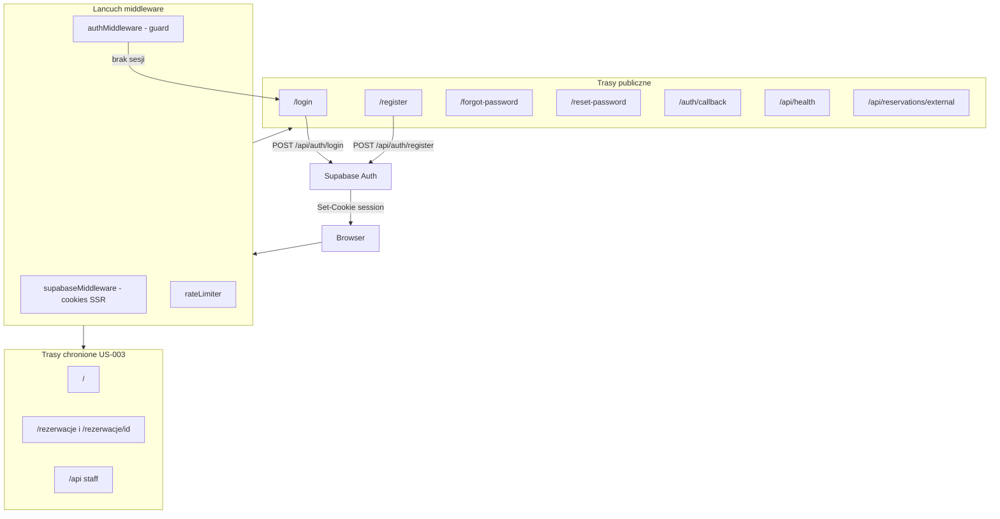
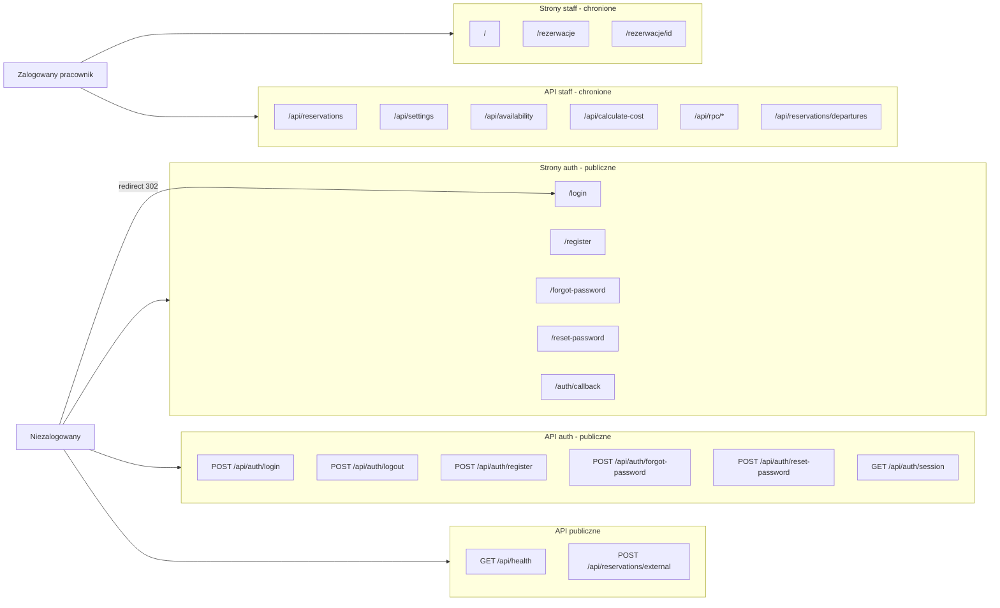
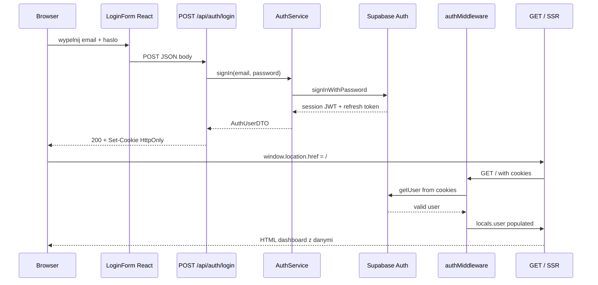

# Specyfikacja architektury autentykacji — ParkTrack

**Wersja:** 1.0  
**Data:** 2026-08-27  
**Status:** Specyfikacja do implementacji (Zadanie 2, lekcja 3x1)  
**Stack:** Astro 5 SSR · React 19 · TypeScript 5 · Supabase Auth · Tailwind 4 · Shadcn/ui

---

## Spis treści

1. [Kontekst i źródła wymagań](#1-kontekst-i-źródła-wymagań)
2. [User Stories (US-003, US-004)](#2-user-stories-us-003-us-004)
3. [Architektura wysokiego poziomu](#3-architektura-wysokiego-poziomu)
4. [Architektura interfejsu użytkownika](#4-architektura-interfejsu-użytkownika)
5. [Logika backendowa](#5-logika-backendowa)
6. [System autentykacji (Supabase Auth + Astro)](#6-system-autentykacji-supabase-auth--astro)
7. [Macierz tras](#7-macierz-tras)
8. [Kontrakt implementacyjny — pliki](#8-kontrakt-implementacyjny--pliki)
9. [Uwagi kompatybilności](#9-uwagi-kompatybilności)
10. [Ryzyka i mitigacje](#10-ryzyka-i-mitigacje)

---

## 1. Kontekst i źródła wymagań

### 1.1 Źródła

| Dokument | Rola |
|---|---|
| Lekcja [`3x1-implementacja-uwierzytelniania-z-supabase-auth.md`](../../10xkurs/3x1-implementacja-uwierzytelniania-z-supabase-auth.md) | Wzorzec US-003/US-004 (adaptacja z 10xRules na ParkTrack) |
| [`.ai/prd.md`](./prd.md) | MVP staff-only, jeden poziom uprawnień, brak modułu kierowców |
| [`.ai/ui-plan.md`](./ui-plan.md) §2.12, §6.3 | UX logowania, mapa nawigacji, wymagania bezpieczeństwa |
| [`context/foundation/tech-stack.md`](../context/foundation/tech-stack.md) | Astro 5 SSR, Supabase Auth + RLS, Node adapter |
| [`astro.config.mjs`](../astro.config.mjs) | `output: "server"`, adapter Node standalone |

### 1.2 Stan wyjściowy kodu

Auth **nie jest zaimplementowany**. Obecny stan:

- [`src/middleware/supabase.ts`](../src/middleware/supabase.ts) — tworzy anon Supabase client bez sesji cookie.
- [`src/middleware/index.ts`](../src/middleware/index.ts) — łańcuch: `supabaseMiddleware` → `rateLimiter` (brak guarda auth).
- Wszystkie strony staff (`/`, `/rezerwacje`, `/rezerwacje/[id]`) i API staff są **publicznie dostępne**.
- RLS w migracjach wymaga roli `authenticated`, ale inserty omijają RLS przez [`src/lib/supabase-admin.ts`](../src/lib/supabase-admin.ts) (service-role).
- [`src/env.d.ts`](../src/env.d.ts) — `locals.user` zadeklarowany, lecz nigdy nie ustawiany.
- [`src/layouts/Layout.astro`](../src/layouts/Layout.astro) i [`src/components/Navigation.tsx`](../src/components/Navigation.tsx) — brak login/logout.
- Brak stron `/login`, `/register`, `/forgot-password`, `/reset-password`.
- Brak pakietu `@supabase/ssr`.

### 1.3 Kluczowa decyzja architektoniczna

Sesja użytkownika przechowywana w **cookies HTTP-only** zarządzanych przez `@supabase/ssr`, a nie w `localStorage`. Decyzja wynika z:

- wymogu SSR w Astro (`output: "server"`) — middleware musi odczytać sesję z requestu;
- rekomendacji lekcji 3x1: *„Po zalogowaniu wykonaj przeładowanie strony server-side"*;
- konieczności przekazywania sesji do chronionych API routes bez ręcznego dodawania nagłówków Authorization w każdym `fetch`.

> **Korekta względem ui-plan:** §2.12 ui-plan wspomina `localStorage` — specyfikacja ujednolica model na cookies SSR.

---

## 2. User Stories (US-003, US-004)

Adaptacja wzorca z lekcji 3x1. W 10xRules US-003 dotyczyło „kolekcji reguł"; w ParkTrack odpowiednikiem jest **cała aplikacja obsługi parkingu**.

### US-003: Dostęp pracowników do systemu zarządzania

**Tytuł:** Dostęp pracowników do systemu zarządzania

**Opis:** Jako pracownik obsługi parkingu chcę, aby dostęp do systemu zarządzania rezerwacjami wymagał aktywnej sesji, aby dane klientów i operacje parkingu były chronione przed nieuprawnionym dostępem.

**Kryteria akceptacji:**

- Pracownik **NIE MOŻE** korzystać z dashboardu (`/`) bez zalogowania (US-004).
- Pracownik **NIE MOŻE** korzystać z listy rezerwacji (`/rezerwacje`) bez zalogowania (US-004).
- Pracownik **NIE MOŻE** korzystać ze szczegółów rezerwacji (`/rezerwacje/[id]`) bez zalogowania (US-004).
- Pracownik **NIE MOŻE** wywoływać chronionych endpointów API staff (`/api/reservations`, `/api/settings`, `/api/availability`, `/api/calculate-cost`, `/api/rpc/*`) bez aktywnej sesji.
- Przy próbie wejścia na chronioną stronę bez sesji system przekierowuje na `/login?redirectTo=<oryginalna-ścieżka>`.
- Przy próbie wywołania chronionego API bez sesji system zwraca `401 Unauthorized` z JSON `{ "error": "Unauthorized" }`.
- Endpoint zewnętrzny `POST /api/reservations/external` pozostaje dostępny **bez sesji browser** — autentykacja maszynowa (API key) w osobnej change; brak regresji integracji ze stroną WWW parkingu.
- Endpoint `/api/health` pozostaje publiczny (monitoring).
- W MVP wszyscy zalogowani pracownicy mają **jeden, pełny poziom dostępu** do wszystkich funkcji (zgodnie z decyzją projektową #10 w PRD).

**Relacje:** zależy od US-004 (mechanizm logowania).

---

### US-004: Bezpieczny dostęp i uwierzytelnianie

**Tytuł:** Bezpieczny dostęp

**Opis:** Jako pracownik obsługi parkingu chcę mieć możliwość rejestracji, logowania i odzyskiwania hasła w sposób zapewniający bezpieczeństwo danych systemu.

**Kryteria akceptacji:**

- Logowanie i rejestracja odbywają się na **dedykowanych stronach** (`/login`, `/register`).
- Logowanie wymaga podania **adresu e-mail i hasła**.
- Rejestracja wymaga podania **adresu e-mail, hasła i potwierdzenia hasła**.
- Odzyskiwanie hasła jest możliwe przez stronę `/forgot-password` i e-mail resetujący od Supabase.
- Ustawienie nowego hasła odbywa się na stronie `/reset-password` po kliknięciu linku z e-maila.
- **Nie korzystamy** z zewnętrznych serwisów logowania (Google, GitHub, OAuth).
- Zalogowany użytkownik widzi swój adres e-mail w menu użytkownika w [`Layout.astro`](../src/layouts/Layout.astro) / [`Navigation.tsx`](../src/components/Navigation.tsx).
- Użytkownik może **wylogować się** z systemu poprzez przycisk „Wyloguj" w menu użytkownika w głównym layoucie aplikacji staff.
- Niezalogowany użytkownik na stronach auth widzi link do logowania / rejestracji (cross-linki między formularzami).
- Po pomyślnym logowaniu użytkownik jest przekierowany na dashboard (`/`) lub na `redirectTo` z query string.
- Po wylogowaniu użytkownik jest przekierowany na `/login`.
- Po rejestracji (projekt chmurowy Supabase) użytkownik otrzymuje e-mail potwierdzający; po kliknięciu linku sesja jest ustanawiana przez `/auth/callback`.

**Relacje:** umożliwia US-003 (dostęp do funkcji staff).

---

## 3. Architektura wysokiego poziomu

### 3.1 Diagram — przepływ autentykacji



### 3.2 Diagram — mapa tras (public vs protected)



### 3.3 Warstwy systemu

| Warstwa | Odpowiedzialność |
|---|---|
| **Strony Astro (SSR)** | Routing, layout, redirect SSR, przekazanie `locals.user` do islandów |
| **Komponenty React** | Formularze auth, walidacja client-side, UX (loading, błędy inline) |
| **API routes Astro** | Cienkie handlery; walidacja Zod; delegacja do `AuthService` |
| **AuthService** | Logika biznesowa auth; mapowanie błędów Supabase |
| **Middleware** | Sesja cookie SSR; guard tras; populacja `locals.user` |
| **Supabase Auth** | Rejestracja, logowanie, reset hasła, JWT, refresh token |
| **PostgreSQL RLS** | Polityki `TO authenticated` — aktywne po sesji staff |

---

## 4. Architektura interfejsu użytkownika

### 4.1 Layouty

#### AuthLayout (nowy)

**Plik:** `src/layouts/AuthLayout.astro`

**Przeznaczenie:** Strony logowania, rejestracji i odzyskiwania hasła.

**Struktura:**
- Minimalny shell HTML (`<html lang="pl">`, meta viewport, favicon, global CSS).
- Wycentrowana karta (max-width ~400px) z logo ParkTrack i podtytułem „System zarządzania parkingiem".
- `<slot />` na treść formularza.
- **Bez** `Navigation`, **bez** `AppProvider`, **bez** sidebara.
- Tło: neutralne (`bg-muted` / gradient subtelny).

**Props opcjonalne:** `title: string` (np. „Logowanie — ParkTrack").

#### Layout (istniejący — rozszerzenie)

**Plik:** `src/layouts/Layout.astro`

**Zmiany:**
- Odczyt `Astro.locals.user` w frontmatter.
- Przekazanie `user` do `Navigation` jako prop React island.
- Dodanie `UserMenu` w dolnej części sidebara (desktop) i w mobile drawer.
- Layout używany **wyłącznie** przez strony staff (chronione przez middleware).

**Zachowanie:** jeśli middleware działa poprawnie, `user` jest zawsze obecny na stronach staff; brak duplikacji guard w layoucie.

---

### 4.2 Strony Astro

Wszystkie strony auth: `export const prerender = false`.

| Trasa | Plik | Odpowiedzialność Astro | React island |
|---|---|---|---|
| `/login` | `src/pages/login.astro` | AuthLayout; redirect na `/` jeśli sesja aktywna; odczyt `redirectTo` z query | `LoginForm` |
| `/register` | `src/pages/register.astro` | AuthLayout; link „Masz konto? Zaloguj się" | `RegisterForm` |
| `/forgot-password` | `src/pages/forgot-password.astro` | AuthLayout; link powrotu do login | `ForgotPasswordForm` |
| `/reset-password` | `src/pages/reset-password.astro` | AuthLayout; przekazanie tokena z hash URL do islandu | `ResetPasswordForm` |
| `/auth/callback` | `src/pages/auth/callback.astro` | Wymiana `code` → sesja cookie; redirect na `/` lub `/login?verified=1` | brak (server-only) |

**Istniejące strony staff** — bez zmian strukturalnych:

| Trasa | Plik | Zmiana |
|---|---|---|
| `/` | `src/pages/index.astro` | brak — ochrona przez middleware |
| `/rezerwacje` | `src/pages/rezerwacje.astro` | brak |
| `/rezerwacje/[id]` | `src/pages/rezerwacje/[id].astro` | już ma `prerender = false` |

---

### 4.3 Komponenty React

#### Podział odpowiedzialności Astro ↔ React

| Odpowiedzialność | Astro | React |
|---|---|---|
| Routing i URL | tak | nie |
| Layout (auth vs app) | tak | nie |
| Redirect SSR (już zalogowany) | tak | nie |
| Walidacja formularza (Zod) | nie | tak (client-side) + API (server-side) |
| Submit formularza auth | nie | tak (`fetch` → API) |
| Loading / disabled state | nie | tak |
| Błędy inline pod polami | nie | tak |
| Błąd ogólny formularza (alert) | nie | tak |
| Po sukcesie logowania | nie | `window.location.href = redirectTo` (full reload) |
| Wylogowanie | nie | `fetch POST /api/auth/logout` → redirect `/login` |
| Formularze rezerwacji (istniejące) | nie | bez zmian — cookies w `fetch` automatycznie |

#### Lista komponentów

| Komponent | Plik | Opis |
|---|---|---|
| `LoginForm` | `src/components/auth/login-form.tsx` | Pola: email, hasło. Linki: rejestracja, zapomniane hasło. Submit → `POST /api/auth/login`. |
| `RegisterForm` | `src/components/auth/register-form.tsx` | Pola: email, hasło, potwierdzenie hasła. Link do login. Submit → `POST /api/auth/register`. |
| `ForgotPasswordForm` | `src/components/auth/forgot-password-form.tsx` | Pole: email. Submit → `POST /api/auth/forgot-password`. Po sukcesie: komunikat (bez ujawniania czy konto istnieje). |
| `ResetPasswordForm` | `src/components/auth/reset-password-form.tsx` | Pola: nowe hasło, potwierdzenie. Token z props (parsowany z URL hash przez Astro lub client). Submit → `POST /api/auth/reset-password`. |
| `PasswordField` | `src/components/auth/password-field.tsx` | Reużywalne pole hasła z ikoną show/hide (Eye/EyeOff). Używane we wszystkich formularzach auth. |
| `UserMenu` | `src/components/auth/user-menu.tsx` | Wyświetla skrócony email. Przycisk „Wyloguj". Wywołuje `POST /api/auth/logout`. |
| `AuthProvider` | `src/components/auth/auth-provider.tsx` | Opcjonalny React context dla stanu UI (np. `isLoggingOut`). **Źródło prawdy sesji = cookie SSR**, nie context. |

#### Wzorzec formularza (zgodny z istniejącymi formularzami rezerwacji)

- `react-hook-form` + `@hookform/resolvers/zodResolver`
- Shadcn/ui: `Form`, `FormField`, `FormItem`, `FormLabel`, `FormControl`, `FormMessage`
- `Button` z `disabled` i spinnerem w stanie loading
- `Alert` (Shadcn) dla błędów ogólnych (np. błędne dane logowania)

#### LoginForm — szczegóły UX

```
┌────────────────────────────────────────────┐
│              ParkTrack                       │
│     System zarządzania parkingiem          │
│                                            │
│  E-mail                                    │
│  [______________________________]          │
│  ⚠ Nieprawidłowy adres e-mail              │
│                                            │
│  Hasło                                     │
│  [______________________________] 👁       │
│                                            │
│  [        Zaloguj się        ]             │
│                                            │
│  Nie masz konta? Zarejestruj się           │
│  Zapomniałeś hasła?                        │
└────────────────────────────────────────────┘
```

- Auto-focus na pole e-mail.
- Enter submituje formularz.
- Po sukcesie: `window.location.href = redirectTo ?? '/'` (server-side reload sesji).

#### Navigation — rozszerzenie

**Plik:** `src/components/Navigation.tsx`

Dodać na dole sidebara (desktop) i w mobile drawer:

```
┌──────────────┐
│ 👤 jan@...   │
│   Wyloguj    │
└──────────────┘
```

Props: `user: { id: string; email: string } | null` — na stronach staff zawsze non-null (middleware).

---

### 4.4 Walidacja i komunikaty błędów

#### Schematy Zod

**Plik:** `src/lib/schemas/auth.schema.ts`

```typescript
import { z } from "zod";

export const loginSchema = z.object({
  email: z
    .string({ required_error: "Podaj adres e-mail" })
    .min(1, "Podaj adres e-mail")
    .email("Nieprawidłowy adres e-mail"),
  password: z
    .string({ required_error: "Podaj hasło" })
    .min(8, "Hasło musi mieć co najmniej 8 znaków"),
});

export const registerSchema = z
  .object({
    email: z
      .string({ required_error: "Podaj adres e-mail" })
      .min(1, "Podaj adres e-mail")
      .email("Nieprawidłowy adres e-mail"),
    password: z
      .string({ required_error: "Podaj hasło" })
      .min(8, "Hasło musi mieć co najmniej 8 znaków"),
    confirmPassword: z
      .string({ required_error: "Potwierdź hasło" })
      .min(1, "Potwierdź hasło"),
  })
  .refine((data) => data.password === data.confirmPassword, {
    message: "Hasła muszą być identyczne",
    path: ["confirmPassword"],
  });

export const forgotPasswordSchema = z.object({
  email: z
    .string({ required_error: "Podaj adres e-mail" })
    .min(1, "Podaj adres e-mail")
    .email("Nieprawidłowy adres e-mail"),
});

export const resetPasswordSchema = z
  .object({
    password: z
      .string({ required_error: "Podaj nowe hasło" })
      .min(8, "Hasło musi mieć co najmniej 8 znaków"),
    confirmPassword: z
      .string({ required_error: "Potwierdź hasło" })
      .min(1, "Potwierdź hasło"),
  })
  .refine((data) => data.password === data.confirmPassword, {
    message: "Hasła muszą być identyczne",
    path: ["confirmPassword"],
  });
```

#### Tabela komunikatów

| Scenariusz | Warstwa walidacji | Komunikat UI (PL) |
|---|---|---|
| Puste pole e-mail | Zod client | „Podaj adres e-mail" |
| Nieprawidłowy format e-mail | Zod client | „Nieprawidłowy adres e-mail" |
| Puste hasło | Zod client | „Podaj hasło" |
| Hasło < 8 znaków | Zod client | „Hasło musi mieć co najmniej 8 znaków" |
| Hasła niezgodne (rejestracja/reset) | Zod refine | „Hasła muszą być identyczne" |
| Błędne dane logowania | Supabase Auth | „Nieprawidłowy e-mail lub hasło" (generyczny) |
| E-mail już zarejestrowany | Supabase signUp | „Konto z tym adresem e-mail już istnieje" |
| E-mail niepotwierdzony | Supabase signIn | „Potwierdź adres e-mail przed logowaniem" |
| Rate limit (429) | Middleware | „Zbyt wiele prób. Spróbuj ponownie za chwilę." |
| Brak sesji (API staff) | authMiddleware | `{ "error": "Unauthorized" }` — bez HTML |
| Token reset wygasł | Supabase | „Link wygasł. Poproś o nowy link resetujący." |
| Sukces rejestracji | — | „Sprawdź skrzynkę e-mail i potwierdź rejestrację." |
| Sukces forgot-password | — | „Jeśli konto istnieje, wysłaliśmy link resetujący na podany adres." |
| Sukces reset hasła | — | „Hasło zostało zmienione. Możesz się zalogować." |
| Błąd sieci / 500 | API | „Wystąpił nieoczekiwany błąd. Spróbuj ponownie." |

---

### 4.5 Scenariusze użytkownika

#### Scenariusz 1: Logowanie pracownika

1. Pracownik otwiera `/login`.
2. Wprowadza e-mail i hasło.
3. Klika „Zaloguj się".
4. `LoginForm` waliduje client-side (Zod).
5. `POST /api/auth/login` → Supabase `signInWithPassword`.
6. API ustawia cookies sesji → odpowiedź `200 { user }`.
7. React wykonuje `window.location.href = '/'`.
8. Middleware odczytuje sesję → dashboard renderuje się z danymi.

#### Scenariusz 2: Deep link bez sesji

1. Pracownik wchodzi na `/rezerwacje/550e8400-e29b-41d4-a716-446655440000`.
2. `authMiddleware` — brak sesji.
3. Redirect `302` → `/login?redirectTo=%2Frezerwacje%2F550e8400-...`.
4. Po logowaniu → redirect na oryginalny URL.

#### Scenariusz 3: Rejestracja nowego pracownika

1. Pracownik otwiera `/register`.
2. Wypełnia e-mail, hasło, potwierdzenie hasła.
3. `POST /api/auth/register` → Supabase `signUp` z `emailRedirectTo: /auth/callback`.
4. UI pokazuje komunikat o weryfikacji e-mail.
5. Pracownik klika link w e-mailu → `/auth/callback?code=...`.
6. Astro wymienia code na sesję cookie → redirect `/login?verified=1`.
7. Pracownik loguje się standardowo.

> **Uwaga lokalna Supabase:** projekt chmurowy wymaga potwierdzenia e-mail; lokalna instancja może mieć wyłączoną weryfikację — implementacja musi obsłużyć oba przypadki (response `201` vs natychmiastowa sesja).

#### Scenariusz 4: Odzyskiwanie hasła

1. Pracownik klika „Zapomniałeś hasła?" na `/login`.
2. Wprowadza e-mail na `/forgot-password`.
3. `POST /api/auth/forgot-password` → Supabase `resetPasswordForEmail` z redirect `/reset-password`.
4. UI zawsze pokazuje ten sam komunikat sukcesu (bezpieczeństwo — brak enumeracji kont).
5. Pracownik klika link w e-mailu → `/reset-password#access_token=...&type=recovery`.
6. `ResetPasswordForm` wysyła nowe hasło → `POST /api/auth/reset-password`.
7. Redirect na `/login` z komunikatem sukcesu.

#### Scenariusz 5: Wylogowanie

1. Zalogowany pracownik klika „Wyloguj" w `UserMenu`.
2. `POST /api/auth/logout` → Supabase `signOut` + wyczyszczenie cookies.
3. `window.location.href = '/login'`.

#### Scenariusz 6: External API (bez regresji)

1. Zewnętrzna strona WWW wysyła `POST /api/reservations/external`.
2. `authMiddleware` — trasa na whitelist → przepuszcza bez sesji staff.
3. `ReservationService` działa jak dotychczas (admin client / anon).
4. Brak zmiany kontraktu odpowiedzi `201 { reservationId, message }`.

---

## 5. Logika backendowa

### 5.1 Endpointy API auth

Wszystkie handlery w `src/pages/api/auth/`. Każdy plik:

```typescript
export const prerender = false;
export const POST: APIRoute = async (context) => { /* ... */ };
```

#### POST `/api/auth/login`

| Aspekt | Wartość |
|---|---|
| Body | `{ email: string, password: string }` — walidacja `loginSchema` |
| Sukces | `200` — `{ user: { id: string, email: string } }` + Set-Cookie (sesja) |
| Błąd walidacji | `400` — `{ error: "Validation failed", details: ZodFormattedError }` |
| Błędne dane | `401` — `{ error: "Nieprawidłowy e-mail lub hasło" }` |
| Błąd serwera | `500` — `{ error: "An unexpected error occurred" }` |

#### POST `/api/auth/logout`

| Aspekt | Wartość |
|---|---|
| Body | brak |
| Sukces | `204 No Content` + wyczyszczenie cookies sesji |
| Błąd | `500` — `{ error: "An unexpected error occurred" }` |

#### POST `/api/auth/register`

| Aspekt | Wartość |
|---|---|
| Body | `{ email, password, confirmPassword }` — walidacja `registerSchema` |
| Sukces (weryfikacja email) | `201` — `{ message: "Sprawdź skrzynkę e-mail..." }` |
| Sukces (bez weryfikacji) | `200` — `{ user: { id, email } }` + Set-Cookie |
| Email zajęty | `409` — `{ error: "Konto z tym adresem e-mail już istnieje" }` |
| Błąd walidacji | `400` |

#### POST `/api/auth/forgot-password`

| Aspekt | Wartość |
|---|---|
| Body | `{ email }` — walidacja `forgotPasswordSchema` |
| Sukces | **Zawsze** `200` — `{ message: "Jeśli konto istnieje, wysłaliśmy link resetujący." }` |
| Błąd walidacji | `400` |

> Celowo brak różnicy odpowiedzi dla istniejącego/nieistniejącego e-maila (ochrona przed enumeracją kont).

#### POST `/api/auth/reset-password`

| Aspekt | Wartość |
|---|---|
| Body | `{ password, confirmPassword, accessToken? }` — walidacja `resetPasswordSchema` + token recovery |
| Sukces | `200` — `{ message: "Hasło zostało zmienione." }` |
| Token wygasły | `400` — `{ error: "Link wygasł. Poproś o nowy link resetujący." }` |
| Błąd walidacji | `400` |

#### GET `/api/auth/session`

| Aspekt | Wartość |
|---|---|
| Sukces | `200` — `{ user: { id, email } }` |
| Brak sesji | `401` — `{ error: "Unauthorized" }` |

---

### 5.2 AuthService

**Plik:** `src/lib/services/auth.service.ts`

```typescript
export class AuthService {
  constructor(private supabase: SupabaseClient<Database>) {}

  async signIn(email: string, password: string): Promise<AuthUserDTO>;
  async signOut(): Promise<void>;
  async signUp(email: string, password: string, redirectTo: string): Promise<SignUpResult>;
  async resetPasswordForEmail(email: string, redirectTo: string): Promise<void>;
  async updatePassword(newPassword: string): Promise<void>;
  async getSession(): Promise<AuthUserDTO | null>;
}
```

**Zasady:**
- Serwis operuje na SSR Supabase client z cookies (nie tworzy własnego klienta).
- Mapuje `AuthApiError` z `@supabase/supabase-js` na user-friendly komunikaty PL.
- Nie loguje haseł ani tokenów.
- `signUp` przekazuje `options.emailRedirectTo` wskazujące na `/auth/callback`.

---

### 5.3 Typy DTO

**Plik:** `src/types.ts` (rozszerzenie)

```typescript
export interface AuthUserDTO {
  id: string;
  email: string;
}

export interface LoginCommand {
  email: string;
  password: string;
}

export interface RegisterCommand {
  email: string;
  password: string;
  confirmPassword: string;
}

export interface ForgotPasswordCommand {
  email: string;
}

export interface ResetPasswordCommand {
  password: string;
  confirmPassword: string;
  accessToken?: string;
}

export interface AuthErrorResponse {
  error: string;
  details?: unknown;
}

export interface AuthSuccessResponse {
  user?: AuthUserDTO;
  message?: string;
}
```

---

### 5.4 Walidacja i obsługa wyjątków

Wzorzec zgodny z [`src/pages/api/reservations.ts`](../src/pages/api/reservations.ts):

```
1. Guard: brak body → 400
2. JSON.parse z try/catch → 400 "Invalid JSON"
3. schema.safeParseAsync(body) → 400 { error, details }
4. AuthService.method() w try/catch:
   a. AuthApiError → mapuj status (401/409/400) + message PL
   b. Error → console.error + 500
5. Sukces → odpowiedni status + JSON body
```

**Mapowanie błędów Supabase:**

| Kod Supabase | HTTP | Komunikat PL |
|---|---|---|
| `invalid_credentials` | 401 | Nieprawidłowy e-mail lub hasło |
| `user_already_exists` | 409 | Konto z tym adresem e-mail już istnieje |
| `email_not_confirmed` | 401 | Potwierdź adres e-mail przed logowaniem |
| `otp_expired` / `token_expired` | 400 | Link wygasł. Poproś o nowy link resetujący. |
| inne | 400/500 | Wystąpił nieoczekiwany błąd. Spróbuj ponownie. |

---

### 5.5 Middleware

#### Łańcuch (aktualizacja)

**Plik:** `src/middleware/index.ts`

```typescript
export const onRequest = sequence(
  supabaseMiddleware,  // refactor: @supabase/ssr + cookies
  authMiddleware,      // nowy: guard tras
  rateLimiter          // bez zmian
);
```

#### supabaseMiddleware (refactor)

**Plik:** `src/middleware/supabase.ts`

Zmiana z `@supabase/supabase-js` `createClient` na `@supabase/ssr` `createServerClient`:

```typescript
import { createServerClient } from "@supabase/ssr";

export const supabaseMiddleware: MiddlewareHandler = async (context, next) => {
  const supabase = createServerClient(
    import.meta.env.SUPABASE_URL,
    import.meta.env.SUPABASE_KEY,
    {
      cookies: {
        getAll: () => context.cookies.getAll(),
        setAll: (cookies) => {
          cookies.forEach(({ name, value, options }) => {
            context.cookies.set(name, value, options);
          });
        },
      },
    }
  );

  // Odśwież sesję (ważne dla SSR)
  const { data: { user } } = await supabase.auth.getUser();

  context.locals.supabase = supabase;
  if (user) {
    context.locals.user = { id: user.id, email: user.email ?? "" };
  }

  return next();
};
```

#### authMiddleware (nowy)

**Plik:** `src/middleware/auth.ts`

**Whitelist — trasy publiczne (bez wymogu sesji):**

```typescript
const PUBLIC_PAGE_PREFIXES = [
  "/login",
  "/register",
  "/forgot-password",
  "/reset-password",
  "/auth/callback",
];

const PUBLIC_API_PREFIXES = [
  "/api/auth/",
  "/api/health",
  "/api/reservations/external",
];

const PUBLIC_ASSET_PREFIXES = [
  "/_astro/",
  "/favicon",
  "/sitemap",
];
```

**Logika:**

```
1. Jeśli pathname pasuje do PUBLIC_* → next()
2. Jeśli brak locals.user:
   a. pathname zaczyna się od /api/ → 401 JSON
   b. inaczej → redirect 302 /login?redirectTo=encodeURIComponent(pathname)
3. Jeśli locals.user istnieje i pathname to strona auth (login/register/...) → redirect 302 /
4. next()
```

---

### 5.6 Renderowanie SSR a astro.config.mjs

**Plik:** [`astro.config.mjs`](../astro.config.mjs) — **bez zmian**.

```javascript
export default defineConfig({
  output: "server",           // wszystkie strony SSR domyślnie
  adapter: node({ mode: "standalone" }),
  // ...
});
```

**Konsekwencje dla auth:**

| Aspekt | Zachowanie |
|---|---|
| Middleware | Ma dostęp do `request.headers` i cookies na każdej trasie |
| Strony auth | `export const prerender = false` — dokumentacja intencji (redundantne przy `output: "server"`, ale zgodne z troubleshooting lekcji) |
| `Astro.locals.user` | Dostępny w frontmatter stron staff po middleware |
| `/auth/callback` | Server-side wymiana code → cookie; brak React island |
| Ostrzeżenie z lekcji | Brak problemu `Astro.request.headers not available on prerendered pages` — globalny SSR |

---

### 5.7 Migracja istniejącej logiki biznesowej

Po wdrożeniu sesji staff planowana jest **stopniowa migracja** (osobne commity implementacyjne):

| Moduł | Obecnie | Docelowo |
|---|---|---|
| `ReservationService` (staff CRUD) | `createSupabaseAdminClient()` bypass RLS | `locals.supabase` z JWT użytkownika |
| `ReservationService` (external) | admin client | **bez zmian** — service-role |
| `settings.ts` PATCH | admin client + zero-UUID fallback | `locals.user.id` jako `updated_by` |
| `created_by` / `last_modified_by` | `get_system_user()` | realny `auth.users.id` z sesji |
| Istniejące React hooks (`fetch('/api/...')`) | bez cookies | **automatycznie** — cookies same |

**Bez regresji w tej change:**
- External API (`/api/reservations/external`) — whitelist middleware.
- Health check (`/api/health`) — whitelist.
- Rate limiter — bez zmian (10 req/min na `/api/*`).
- Kontrakt JSON istniejących API — bez zmian.

---

## 6. System autentykacji (Supabase Auth + Astro)

### 6.1 Diagram sekwencji — sesja cookie



### 6.2 Zależności npm

Dodać do [`package.json`](../package.json):

```json
"@supabase/ssr": "^0.6.0"
```

Istniejący `@supabase/supabase-js` (^2.76.0) pozostaje — `@supabase/ssr` go wykorzystuje wewnętrznie.

### 6.3 Klienty Supabase

| Moduł | Plik | Klient | Użycie |
|---|---|---|---|
| Server SSR | `src/db/supabase.server.ts` | `createServerClient` (@supabase/ssr) | Middleware, API routes auth, callback |
| Browser (opcjonalny) | `src/db/supabase.browser.ts` | `createBrowserClient` (@supabase/ssr) | Parsowanie hash recovery token (fallback) |
| Admin (bez zmian) | `src/lib/supabase-admin.ts` | `createClient` service-role | External API, seedy, operacje systemowe |
| Legacy | `src/db/supabase.client.ts` | `createClient` anon | **Deprecate** — nie importować w routes |

**Helper `createSupabaseServerClient(cookies)`** — fabryka w `supabase.server.ts` używana przez middleware i handlery API (DRY dla konfiguracji cookies).

### 6.4 Przepływ rejestracji (Supabase cloud)

```typescript
// AuthService.signUp — kontrakt implementacyjny
const { data, error } = await supabase.auth.signUp({
  email,
  password,
  options: {
    emailRedirectTo: `${origin}/auth/callback`,
  },
});
```

**/auth/callback** (server-only):

```typescript
// src/pages/auth/callback.astro — logika w frontmatter
const code = Astro.url.searchParams.get("code");
if (code) {
  const supabase = createSupabaseServerClient(Astro.cookies);
  await supabase.auth.exchangeCodeForSession(code);
}
return Astro.redirect("/login?verified=1");
```

### 6.5 Przepływ reset hasła

1. `AuthService.resetPasswordForEmail(email, redirectTo)` — Supabase wysyła e-mail.
2. Link w e-mailu: `{origin}/reset-password#access_token=...&type=recovery&...`.
3. `ResetPasswordForm` odczytuje token z hash (client-side) lub Astro przekazuje jako prop.
4. `POST /api/auth/reset-password` — `supabase.auth.updateUser({ password })` na sesji recovery.

### 6.6 Konfiguracja Supabase Dashboard (poza kodem)

| Ustawienie | Wartość dev | Wartość prod |
|---|---|---|
| Site URL | `http://localhost:3000` | URL Railway / produkcji |
| Redirect URLs | `http://localhost:3000/auth/callback` | `{prod}/auth/callback` |
| Redirect URLs | `http://localhost:3000/reset-password` | `{prod}/reset-password` |
| Email provider | Włączony (SMTP Supabase lub własny) | j.w. |
| Confirm email | Włączone (cloud default) | Włączone |
| OAuth providers | **Wyłączone** (Google, GitHub off) | Wyłączone |

Szablony e-mail (PL): confirm signup, reset password, magic link (nieużywany w MVP).

> **Lekcja 3x1 — konfiguracja URL:** Po wdrożeniu na produkcję zaktualizować Site URL, inaczej maile będą kierować na `localhost:3000`.

### 6.7 RLS i tożsamość

Istniejące polityki w [`supabase/migrations/`](../supabase/migrations/):

```sql
-- Przykład: reservations
CREATE POLICY "Authenticated users can select reservations"
  ON reservations FOR SELECT TO authenticated USING (true);
```

Po wdrożeniu sesji cookie:
- `locals.supabase` (anon key + JWT użytkownika w cookie) → rola `authenticated` w PostgreSQL.
- RLS zaczyna obowiązywać dla operacji staff bez service-role bypass.
- Tabele z FK do `auth.users`: `reservations.created_by`, `reservations.last_modified_by`, `settings.updated_by`, `payments.created_by`.

**Brak tabeli `public.profiles`** — MVP nie wymaga; email z `auth.users` wystarczy do UI.

### 6.8 Zmienne środowiskowe

| Zmienna | Wymagana | Opis |
|---|---|---|
| `SUPABASE_URL` | tak | URL projektu Supabase |
| `SUPABASE_KEY` | tak | Anon/public key |
| `SUPABASE_SERVICE_ROLE_KEY` | tak (admin ops) | Service role — external API, seedy |
| `API_SECRET_KEY` | opcjonalna | Przyszła autentykacja external API |

Bez zmian w konwencji nazewnictwa ([`src/env.d.ts`](../src/env.d.ts)).

---

## 7. Macierz tras

| Trasa | Metoda | Dostęp | Brak sesji → |
|---|---|---|---|
| `/login` | GET | publiczny | render formularza |
| `/register` | GET | publiczny | render formularza |
| `/forgot-password` | GET | publiczny | render formularza |
| `/reset-password` | GET | publiczny | render formularza |
| `/auth/callback` | GET | publiczny | wymiana code → redirect |
| `/` | GET | **chroniony** | redirect `/login?redirectTo=/` |
| `/rezerwacje` | GET | **chroniony** | redirect `/login?redirectTo=/rezerwacje` |
| `/rezerwacje/[id]` | GET | **chroniony** | redirect `/login?redirectTo=...` |
| `/api/auth/login` | POST | publiczny | — |
| `/api/auth/logout` | POST | publiczny* | — |
| `/api/auth/register` | POST | publiczny | — |
| `/api/auth/forgot-password` | POST | publiczny | — |
| `/api/auth/reset-password` | POST | publiczny | — |
| `/api/auth/session` | GET | publiczny | 401 |
| `/api/health` | GET | publiczny | — |
| `/api/reservations/external` | POST | publiczny** | — |
| `/api/reservations` | GET/POST/PATCH/DELETE | **chroniony** | 401 JSON |
| `/api/settings` | GET/POST/PATCH | **chroniony** | 401 JSON |
| `/api/availability` | GET | **chroniony** | 401 JSON |
| `/api/calculate-cost` | GET/POST | **chroniony** | 401 JSON |
| `/api/rpc/get_todays_arrivals` | GET | **chroniony** | 401 JSON |
| `/api/reservations/departures` | GET | **chroniony** | 401 JSON |
| `/_astro/*` | GET | publiczny (assety) | — |

\* `/api/auth/logout` — publiczny endpoint; brak sesji → 204 (idempotentny).  
\*\* External API — autentykacja API key planowana osobno; obecnie whitelist bez sesji staff.

---

## 8. Kontrakt implementacyjny — pliki

### 8.1 Pliki do utworzenia

| Plik | Opis |
|---|---|
| `.ai/auth-spec.md` | Ten dokument |
| `src/layouts/AuthLayout.astro` | Layout stron auth |
| `src/pages/login.astro` | Strona logowania |
| `src/pages/register.astro` | Strona rejestracji |
| `src/pages/forgot-password.astro` | Strona zapomnianego hasła |
| `src/pages/reset-password.astro` | Strona resetu hasła |
| `src/pages/auth/callback.astro` | Callback OAuth/code exchange |
| `src/pages/api/auth/login.ts` | Handler logowania |
| `src/pages/api/auth/logout.ts` | Handler wylogowania |
| `src/pages/api/auth/register.ts` | Handler rejestracji |
| `src/pages/api/auth/forgot-password.ts` | Handler forgot password |
| `src/pages/api/auth/reset-password.ts` | Handler reset password |
| `src/pages/api/auth/session.ts` | Handler sesji (GET) |
| `src/middleware/auth.ts` | Guard tras |
| `src/db/supabase.server.ts` | SSR Supabase client |
| `src/db/supabase.browser.ts` | Browser Supabase client (opcjonalny) |
| `src/lib/services/auth.service.ts` | Serwis auth |
| `src/lib/schemas/auth.schema.ts` | Schematy Zod |
| `src/components/auth/login-form.tsx` | Formularz logowania |
| `src/components/auth/register-form.tsx` | Formularz rejestracji |
| `src/components/auth/forgot-password-form.tsx` | Formularz forgot password |
| `src/components/auth/reset-password-form.tsx` | Formularz reset password |
| `src/components/auth/password-field.tsx` | Reużywalne pole hasła |
| `src/components/auth/user-menu.tsx` | Menu użytkownika |
| `src/components/auth/auth-provider.tsx` | Context UI (opcjonalny) |

### 8.2 Pliki do modyfikacji

| Plik | Zmiana |
|---|---|
| `package.json` | Dodać `@supabase/ssr` |
| `src/middleware/index.ts` | Dodać `authMiddleware` do sequence |
| `src/middleware/supabase.ts` | Refactor na `@supabase/ssr` + `locals.user` |
| `src/env.d.ts` | Rozszerzyć `Locals.user` o `email: string` |
| `src/types.ts` | Dodać DTO auth |
| `src/layouts/Layout.astro` | Przekazać `user` do Navigation |
| `src/components/Navigation.tsx` | Dodać `UserMenu` |
| `src/db/supabase.client.ts` | Oznaczyć jako deprecated / usunąć importy z routes |

### 8.3 Pliki bez zmian (w tej fazie)

| Plik | Powód |
|---|---|
| `astro.config.mjs` | `output: "server"` wystarczy |
| `src/pages/index.astro` | Ochrona przez middleware |
| `src/pages/rezerwacje.astro` | j.w. |
| `src/pages/rezerwacje/[id].astro` | j.w. |
| `src/pages/api/reservations/external.ts` | Whitelist; bez regresji |
| `src/pages/api/health.ts` | Publiczny |
| `src/middleware/rate-limit.ts` | Bez zmian |
| Istniejące komponenty rezerwacji | Cookies działają automatycznie |

### 8.4 Kolejność implementacji (Zadania 3–4 lekcji)

1. **Fundament:** `@supabase/ssr`, `supabase.server.ts`, refactor middleware
2. **Backend auth:** schematy, AuthService, endpointy `/api/auth/*`
3. **UI auth:** AuthLayout, strony, formularze React
4. **Guard:** `authMiddleware`, test redirectów
5. **Layout staff:** UserMenu, wylogowanie
6. **Rejestracja + reset hasła:** register, forgot-password, reset-password, callback
7. **Migracja RLS:** stopniowe przejście z admin client na authenticated client
8. **Weryfikacja:** `npm run lint`, `npm run build`, test manualny scenariuszy 1–6

---

## 9. Uwagi kompatybilności

### 9.1 Zachowanie istniejącej aplikacji

| Obszar | Wymaganie | Jak spec to zapewnia |
|---|---|---|
| External API rezerwacji | Bez zmian kontraktu | Whitelist w authMiddleware |
| Health check | Publiczny | Whitelist |
| Rate limiting | Bez zmian | rateLimiter po authMiddleware |
| Formularze rezerwacji | Działają po zalogowaniu | Cookies w fetch; brak zmian w hookach |
| Single role MVP | Jeden poziom dostępu | Brak RBAC; `locals.user` bez `role` check |
| Brak modułu kierowców | Staff-only app | Rejestracja = onboarding pracowników |
| RLS w bazie | Aktywacja po sesji | JWT w cookie → rola `authenticated` |

### 9.2 Zgodność z konwencjami projektu

| Konwencja | Zastosowanie w auth |
|---|---|
| `export const prerender = false` w API | Wszystkie `/api/auth/*` |
| Named exports `GET`, `POST` | Handlery auth |
| Zod na granicy API | Wszystkie POST auth |
| Logika w `src/lib/services/` | `AuthService` |
| Typy w `src/types.ts` | DTO auth |
| React tylko dla interaktywności | Formularze auth jako islands |
| Brak `"use client"` | Astro, nie Next.js |
| Supabase z `locals.supabase` | Middleware SSR client |
| Shadcn/ui | Form, Button, Alert, Input |

### 9.3 Różnice względem ui-plan

| ui-plan | auth-spec | Powód |
|---|---|---|
| Session w localStorage | Cookies HTTP-only SSR | SSR + middleware guard |
| Tylko `/login` | + register, forgot, reset, callback | US-004 + lekcja 3x1 |
| `signInWithPassword` z klienta | Przez API `/api/auth/login` | Bezpieczniejsze; spójne cookies |

---

## 10. Ryzyka i mitigacje

| Ryzyko | Prawdopodobieństwo | Wpływ | Mitigacja |
|---|---|---|---|
| ui-plan sugeruje localStorage | wysokie | średni | Spec jawnie wybiera cookies; ui-plan zaktualizować przy implementacji |
| Brak `@supabase/ssr` w package.json | pewne | bloker | Dodać w pierwszym kroku implementacji |
| External API bez API key dziś | wysokie | średni | Whitelist middleware; API key w osobnej change |
| Rejestracja otwarta publicznie | średnie | niski | MVP: strona dostępna; opcjonalnie wyłączyć signUp w Supabase Dashboard |
| Admin client bypass RLS | obecny stan | średni | Stopniowa migracja po auth; admin zostaje dla external |
| E-mail redirect na localhost w prod | średnie | wysoki | Konfiguracja Site URL w Supabase przed go-live |
| Brak użytkownika testowego w bazie | średnie | bloker testów | Utworzyć użytkownika w Supabase Dashboard przed Zadaniem 3 |
| DELETE reservations bez polityki RLS | istniejący | niski | Osobna migracja DELETE policy po auth |

---

## Appendix A: Przykładowe payloady API

### Login — request / response

```json
// POST /api/auth/login
// Request
{ "email": "jan.kowalski@parking.pl", "password": "haslo1234" }

// Response 200
{ "user": { "id": "uuid", "email": "jan.kowalski@parking.pl" } }

// Response 401
{ "error": "Nieprawidłowy e-mail lub hasło" }
```

### Register — request / response

```json
// POST /api/auth/register
// Request
{ "email": "nowy@parking.pl", "password": "haslo1234", "confirmPassword": "haslo1234" }

// Response 201
{ "message": "Sprawdź skrzynkę e-mail i potwierdź rejestrację." }
```

### Session — response

```json
// GET /api/auth/session
// Response 200
{ "user": { "id": "uuid", "email": "jan.kowalski@parking.pl" } }

// Response 401
{ "error": "Unauthorized" }
```

---

*Dokument wygenerowany jako deliverable Zadania 2 (Architektura uwierzytelniania) — lekcja 3x1, kurs 10xDevs 2.*
